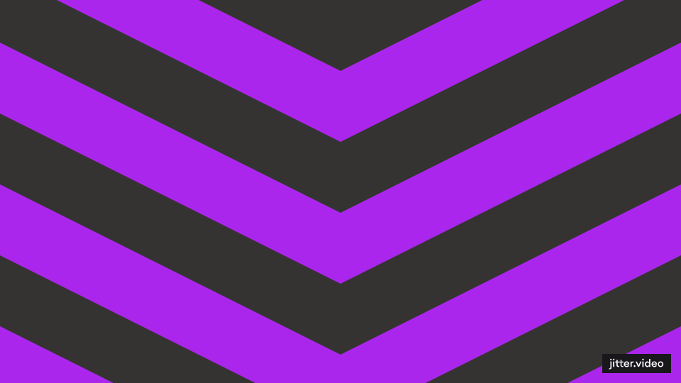

# Hi there! 👋

  

I'm Kushal Pipaliya, a passionate Full Stack Developer with a keen interest in cyber security and penetration testing.

## About Me
- 💻 Currently mastering Full Stack Development with a focus on robust and secure applications.
- 🚀 On a journey to explore HTML5, CSS3, JavaScript, C++, C#, Java, Python, and PHP.
- 🌐 Excited to dive into the world of ethical hacking, exploring the latest tools in Kali Linux.

## Cyber Security & Penetration Testing
- 🕵️ Actively engaged in ethical hacking methodologies.
- 🔐 Specializing in security concepts, ensuring applications are robust against threats.
- 🛠️ Proficient in using Kali Linux tools such as:
  - Burp Suite
  - Metasploit
  - Nmap
  - Wireshark
- 🚨 Experienced in identifying and addressing vulnerabilities in web applications.
- 📚 Currently delving into advanced topics like:
  - Cryptography
  - Secure coding practices
  - Exploit development

## Let's Connect!

 
  
  
  
  

## Languages and Tech Toolbox
- 👨‍💻 Proficient in C++, C#, Java, Python, HTML, CSS, React.
- 📱 Experienced in Android development.
- 🛠️ Worked with MongoDB, Firebase, and Blender.

Feel free to connect if you share an interest in secure and cutting-edge development! 🚀

